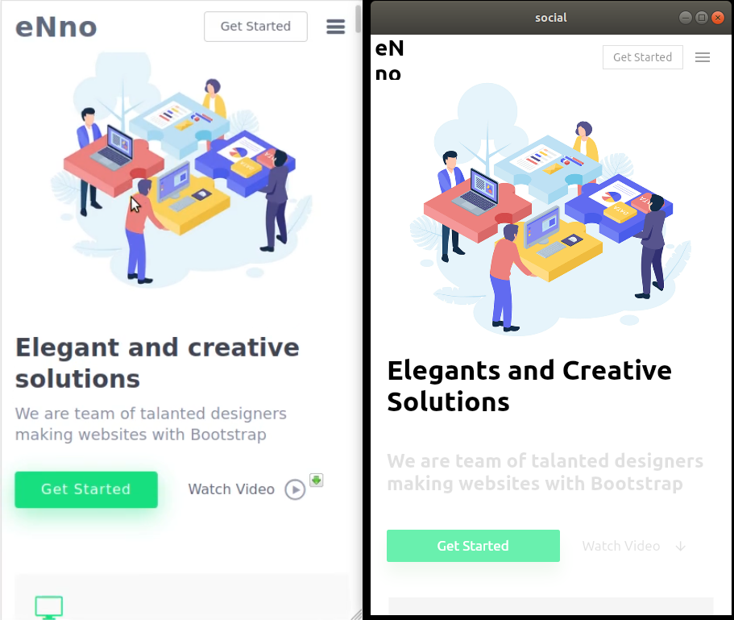

# WEBSITE DESKTOP APP FLUTTER

## Getting Started

This project is a starting point for a Flutter application.

## Original Design
#### Preview

## Preview

## Built By

FLutter 

By Dassi Manuel 

<a href="mailto:manuel.dassi@2024.ucac-icam.com">manuel.dassi@2024.ucac-icam.com</a> 
<a href="mailto:dassi.manuel000@gmail.com">dassi.manuel000@gmail.com</a> 

<a href="https://www.linkedin.com/in/manuel-dassi-a43bbb195/">linkedin in Manuel-Dassi </a> 

<a href="https://github.com/dassimanuel000/">Github in Manuel-Dassi </a> 

## Connect with me:
- [PORTFOLIO](http://www.ceo.life-cm.com/)
- [youtube](https://www.youtube.com/channel/UCLPkZBskeCbhCBKrbSq_ssw)
- [Github](https://github.com/dassimanuel000/)
- [Twitter](https://twitter.com/mr_manuelD)

### Installation

If you're new to Flutter the first thing you'll need is to follow the [setup instructions](https://flutter.dev/docs/get-started/install). 

Once Flutter is setup, you can use the default `stable` channel, or switch to the latest `dev` version to get the most current fixes for desktop/web:
 * Run `flutter channel dev`
 * Run `flutter upgrade`

If you've never run a desktop build before, you will need to enable it with a one-time command for your current platform:
* `flutter config --enable-macos-desktop`
* `flutter config --enable-windows-desktop`
* `flutter config --enable-linux-desktop`

Once you're on `dev` and desktop is enabled, you're ready to run the app:
* `flutter run -d windows`
* `flutter run -d macos`
* `flutter run -d linux`
* `flutter run -d android`
* `flutter run -d ios`
* `flutter run -d web`

